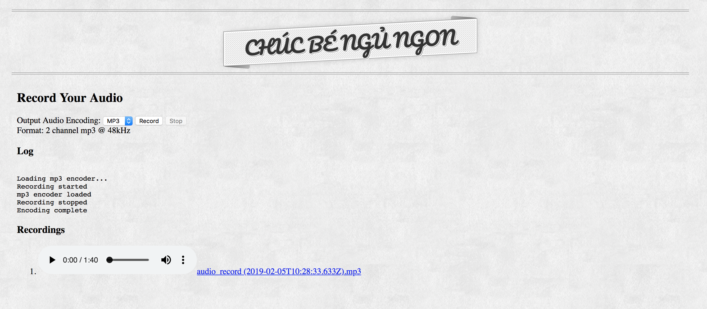
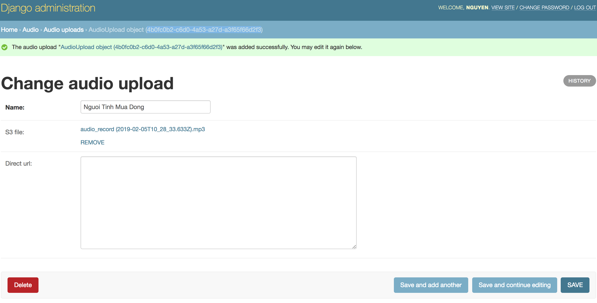
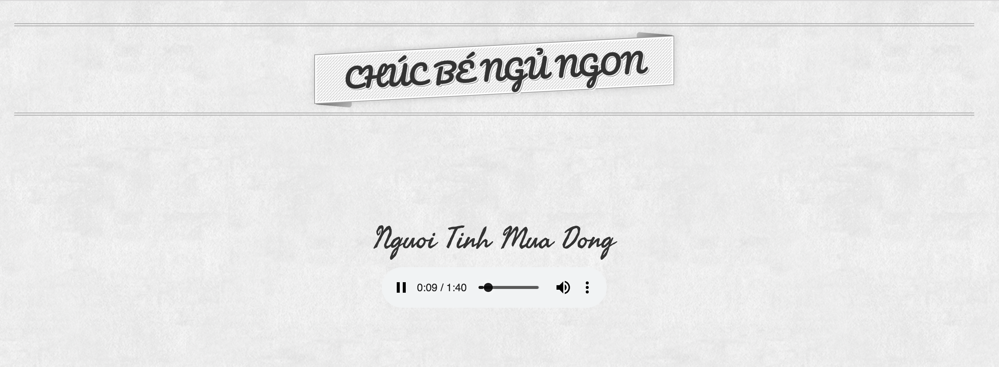

# audio-sharing

Simple Python Django + HTML + vanilla JS application for recording and sharing audio

- This project is configured to be deployed on *Heroku*: https://www.heroku.com/
- Audio recording is done by using https://github.com/higuma/web-audio-recorder-js

# File Upload

- First choice was to upload to DropBox using `django-storages`: https://github.com/jschneier/django-storages
- Because `heroku` has a 30s time limit for each request, I tried using `django-queued-storage` (https://github.com/jazzband/django-queued-storage) to first store the file in local file system (not working well with `heroku`'s file system) or database (still too slow) and then upload it in a background worker using celery => still can't beat 30s for large files :(
- Settled with using `django-s3direct` (https://github.com/bradleyg/django-s3direct) to upload files directly from client to Amazon S3

# Some environment variables we should pay attention to

- `SECRET_KEY`: make sure it's different between development and production
- `DJANGO_SETTINGS_MODULE`: for this project, it should be `commons.settings.dev` for development and `commons.settings.prod` for production
- `ALLOWED_HOSTS`: Read Django's Doc: https://docs.djangoproject.com/en/dev/ref/settings/#allowed-hosts

# Demo/Screenshot

- Audio Recording: https://chuc-be-ngu-ngon.herokuapp.com/

- Upload done in Django Admin (sorry, no url, I don't want people to use my site for file sharing)

- Playback: http://chuc-be-ngu-ngon.herokuapp.com/play/4b0fc0b2-c6d0-4a53-a27d-a3f65f66d2f3/ (Sung by yours truly :blush:)

